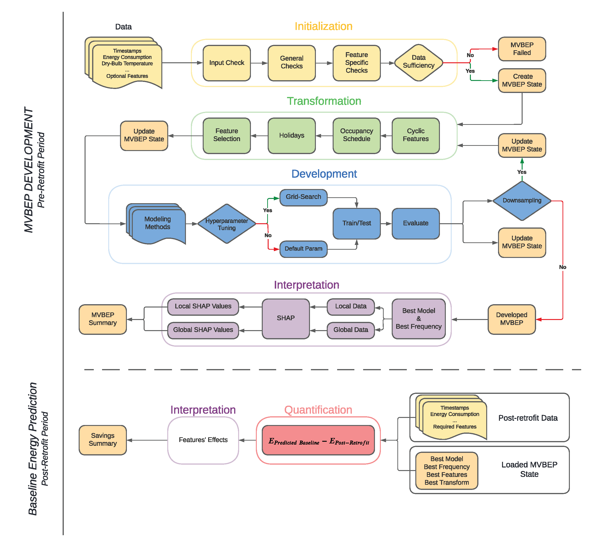
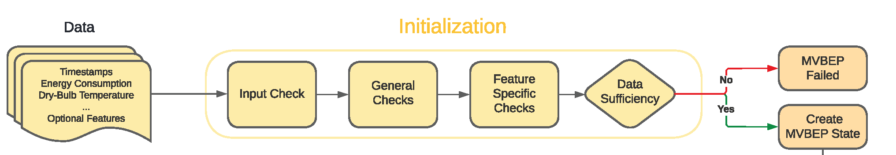
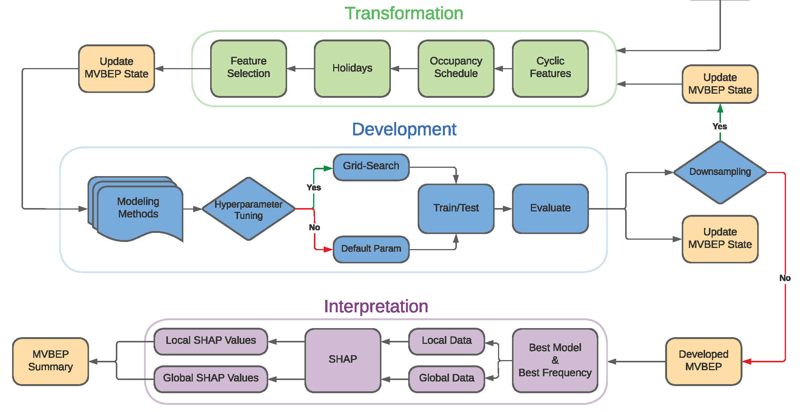
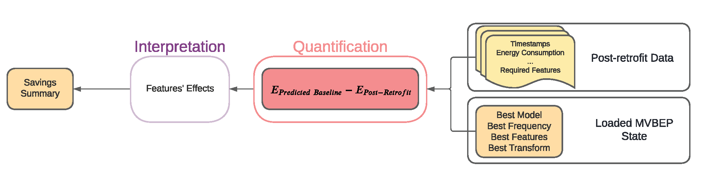

Package Usage
=================================

Installation
------------
The package has not been published on PyPI. To use the package, clone the `GitHub repository <github.com/Robaie98/mvbep>`_ and use the package as described by the documentation and as shown in the example `Jupyter Notebook <https://github.com/Robaie98/mvbep/blob/master/mvbep_example.ipynb>`_ until the package is published. 

.. >>> $ pip install mvbep

Requirements
++++++++++++

::

   holidays==0.14.2
   joblib==1.1.0
   numpy==1.20.3
   pandas==1.3.4
   plotly==5.7.0
   schema==0.7.5
   scikit_learn==1.1.2
   shap==0.41.0
   statsmodels==0.12.2
   xgboost==1.6.0

MVBEP
-----

Measurement and Verification Building Energy Prediction (MVBEP) is an open-source framework for developing data-driven models for predicting the building baseline energy consumption and estimating savings associated with retrofitting in the post-retrofit period. The package relies on three main steps to quantify the achieved savings in the post-retrofit period: 

- Initialization
- Development
- Quantification

Each step is described with examples below 

Initialization
++++++++++++++

The initialization process aims to determine if the input data is sufficient to build a baseline. This is enforced by using thresholds that can be edited by the user.

Initialization Data Sufficiency Checks
______________________________________
1. Input Check
''''''''''''''
- **Minimum Features**:
  The supplied ``pd.DataFrame`` must have at least features: timestamps, energy consumption, and outdoor dry-bulb temperature.
- **Possible Frequency**:
  The timestamps frequency or intervals of recorded values should be either 15-min or hourly. The package does not support yet daily frequency.   

2. General Checks
''''''''''''''''''
- *Minimum Time Range*:
  The data must include at least a range of 365 days. This threshold can be modified by the user by passing a different value for ``n_days`` when using :py:meth:`~mvbep.mvbep.MVBEP.fit_training()`. 

- **Maximum Number of Missing Values**:
  This threshold is dependent of the input data frequency. The threshold represents 10% of the possible values count in a year.

  - If ``15-min``, the threshold is 3,500 values. 
  - If ``hourly``, the threshold is 876 values. 

- **Maximum Number of Consecutive Missing Values**
  This threshold aims to limit the effect of many consecutive missing values which is difficult to replace. Based on the frequency, the threshold is set to represent a full repeating important cycle (i.e. one day for both ``15-min`` and ``hourly``. 

  - If ``15-min``, the threshold is 96 values. 
  - If ``hourly``, the threshold is 24 values.  

3. Feature-Specific Checks
'''''''''''''''''''''''''''
- **Timestamps Format Mismatch Fraction**: 
  The MVBEP model will fail if more than 30% of the timestamps are not consistent. In addition, jumps in timestamps are interpreted as missing values. If the input data span more than a year and the first year contains many missing values, it is recommended that the data is cropped to include the continuous part that does not have many missing values.  

- **Energy Consumption**
  Negative and zero values are interpreted as missing values. The missing values for all features are replaced by using :py:meth:`pandas.Series.interpolate()`. 

Initialization Example 
_________________________
The following example is derived from the `example notebook <https://github.com/Robaie98/mvbep/blob/master/mvbep_example.ipynb>`_. 

>>>   from mvbep.mvbep import MVBEP 
>>>   mvbep_obj = MVBEP() # An object of class MVBEP is initialized
>>>   mvbep_obj.fit_training(
...      data                    = df_input,   # Required
...      frequency               = '15-min',   # Required
...      country_code            = None,       # Optional
...      occupancy_schedule      = None,       # Optional
...      mismatch_date_threshold = 0.3,        # Optional
...      total_missing           = None,       # Optional
...      max_consec_missing      = None,       # Optional
...      n_days                  = 360         # Optional
...   ) 

  
1. ``country_code``: The passed value must match the supported country codes as highlighted by `holidays library <https://pypi.org/project/holidays/>`_. 
2. ``occupancy_schedule``: The passed dictionary must match the shape provided below 
   
>>> annual_list = ['DD-MM' , ..., 'DD-MM']     # Days with generally low occupancy density. 
... day_dict = {                               # This represents the general weekly occupancy schedule.
...     '08-10': float,                        # The float represents the general occupancy fraction 
...                                            #    (i.e. 1 for the highest occupant density). 
...                                            #    Unoccupied hours should not be included).
...     '11-15': float,
...     '16-17': float, 
... }   
... schedule = {                               # This is the final input that goes inside fit_training(). 
...     'annually': annual_list,
...     'weekly': {
...         'mon': day_dict,                   # Different days can have different schedules
...         'tue': day_dict,
...         'wed': day_dict, 
...         'thu': day_dict,
...         'fri': day_dict,
...         'sat': None,                       # None indicates that the day is generally not occupied.
...         'sun': None
...     }
... }

Initialization Summary Report
_____________________________
This `link  <https://htmlpreview.github.io/?https://github.com/Robaie98/mvbep/blob/master/outputs/initilization_summary.html>`_ shows an example of the initialization summary report that is generated after running :py:meth:`~mvbep.mvbep.MVBEP.generate_initialization_summary()`. Check :ref:`examples:Initialization Report` for more information.

Development
++++++++++++++

The development process aims to take the checked input data and use it to build a baseline for the M&V analysis.   

Development Process
___________________
The development process encompasses the following three modules: 

- **Transformation**: Processes the verified input data to suitable data tha can be used to train and test the modeling methods. 
- **Development**: Trains and evaluates the trained models. If :py:meth:`~mvbep.mvbep.MVBEP.develop_mvbep()` function ``hyperparameter_tuning`` parameter was passed by ``True``, hyperparameter tuning is performed for the trained models by using rolling cross-validation.
- **Interpretation**: Provides local and global features' contributions for the testing dataset. 

If the function :py:meth:`~mvbep.mvbep.MVBEP.fit_training()` was provided with a data that has a 15-min frequency, the development process will downsample the frequency to lower one (e.g. 15-min to hourly). The resulting hourly frequency will also be converted to a daily frequency. In case only hourly input data was used for :py:meth:`~mvbep.mvbep.MVBEP.fit_training()`, the resulting downsampling will be only from hourly to daily.

Development Example
___________________
After successfully fitting the ``MVBEP`` object with input data and checking the initialization report, the ``MVBEP`` object starts processing the data and fitting the passed modeling methods in :py:meth:`~mvbep.mvbep.MVBEP.fit_training()` function. The following code block shows an example of starting the development phase for ``mvbep_obj``. 

>>> mvbep_obj.develop_mvbep(
...        modeling_methods      = None,        # Optional
...        test_size             = 0.2,         # Optional
...        hyperparameter_tuning = False,       # Optional
...        ranking_method        = 'min_cvrmse' # Optional
... )

Development Summary Report
_____________________________
This `link <https://htmlpreview.github.io/?https://github.com/Robaie98/mvbep/blob/master/outputs/development_summary.html>`__ shows an example of the development summary report that is generated after running :py:meth:`~mvbep.mvbep.MVBEP.generate_development_summary()`. Check :ref:`examples:Development Report` for more information.

Quantification 
++++++++++++++

Quantification is the process of using post-retrofit data to quantify the achieved savings or Avoided Energy Use (AEU). 

Quantification Process
______________________
The process takes the ``MVBEP`` object that was developed by using :py:meth:`~mvbep.mvbep.MVBEP.develop_mvbep()` and uses the post-retrofit data to make predictions. The sum of predictions minus the sum of recorded energy use in the post-retrofit data represents the AEU. The data is checked first by similar data sufficiency requirements like those mentioned in :ref:`usage:Initialization Data Sufficiency Checks`. The time range threshold is not used but two thresholds are added: post-retrofit min date and minimum features. The former aims to avoid having timestamps that are observed in the pre-retrofit (i.e. input data for :py:meth:`~mvbep.mvbep.MVBEP.fit_training()`) while the latter aims to highlight any missing features that was used in the transformation process. 

Quantification Example
______________________
After successfully developing the ``mvbep_obj`` data by using :py:meth:`~mvbep.mvbep.MVBEP.develop_mvbep()` any valid post-retrofit data can be used to calculate the AEU. The code block below shows an example of using the same ``mvbep_obj`` in the previous examples 

>>> mvbep_obj.predict_energy_consumption(
...             data                    = post_retrofit,     # Required
...             generate_summary        = False,             # Optional
...             file_name               = None,              # Optional
...             mismatch_date_threshold = 0.3,               # Optional
...             total_missing           = None,              # Optional
...             max_consec_missing      = None               # Optional
... )

Quantification Summary Report
_____________________________
`This link <https://htmlpreview.github.io/?https://github.com/Robaie98/mvbep/blob/master/outputs/quantification_summary.html>`__ shows an example of the quantification summary report that is generated after running :py:meth:`~mvbep.mvbep.MVBEP.predict_energy_consumption()`. Check :ref:`examples:Quantification Report` for more information.

